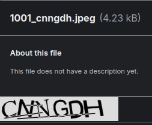
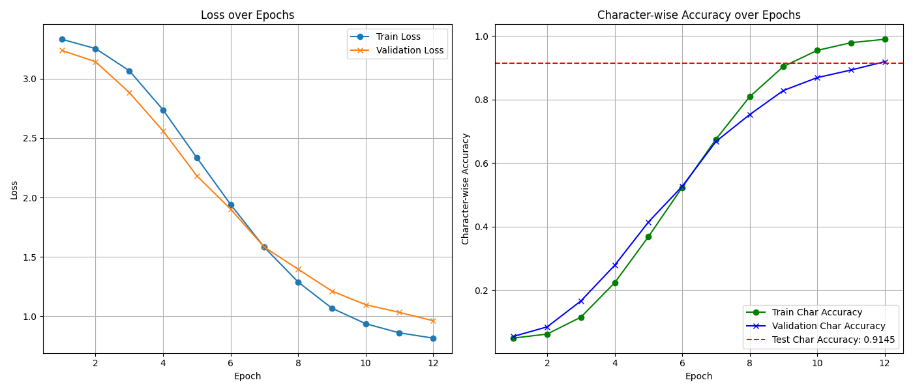
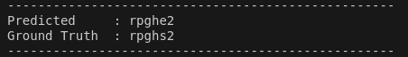

# ResNet-For-Captcha-Identification
Includes a ResNet50 implmentation for captcha recognition.

<br>

## Table of Contents

- [Installation](#installation)
- [Usage](#usage)
- [Dataset Information](#dataset-information)
- [Training/Inference code and Performance visualisation](#traininginference-code-and-performance-visualisation)
- [About the Model](#about-the-model)
- [Performance Metrices](#performance-metrics)

<br>

## Installation

To run this project, you need to have Python installed. We recommend using a virtual environment to manage dependencies.

1. **Clone the repository**:
    ```sh
    git clone <repository-url>
    cd <repository-folder>
    ```

2. **Create a virtual environment**:
    ```sh
    python -m venv env
    source env/bin/activate  # On Windows, use `env\Scripts\activate`
    ```

3. **Install dependencies**:
    ```sh
    pip install -r requirements.txt
    ```

<br>

## Usage

1.  **Run main.py to train and test the model**:
    ```sh
    python3 main.py
    ```
2. The following are the files and their purpose :
   
    - **dataset.py** : This file preprocesses a CAPTCHA image dataset by loading, resizing, and normalizing grayscale images, encoding their labels into character indices, splitting the data into train/test sets, and wrapping it in a PyTorch Dataset class for model training.
    - **model_save.py** : This script saves the trained CAPTCHA recognition model to disk using torch.save and provides a downloadable link for the saved model checkpoint.
    - **main.py** : This Python script trains, evaluates, and visualizes a deep learning model for character recognition using a custom dataset.
    - **Resnet_block.py** : This code defines a bottleneck residual block (Resblock) used in deep ResNet architectures, which enables efficient training of deep convolutional neural networks by allowing identity shortcuts for gradient flow.
    - **Resnet_model_complete.py** : This code defines the ResNetCaptcha model—a deep ResNet-based convolutional neural network tailored for multi-character CAPTCHA recognition, where the model predicts each character in the CAPTCHA sequence using a separate classifier head.
    - **test.py** : This file defines a test function that evaluates a CAPTCHA-solving model's character-level accuracy by comparing predicted characters against ground truth labels on a test dataset.
    - **train.py** : This file defines a training function that trains a ResNet-based CAPTCHA solver for 12 epochs using train/validation splits, tracking both loss and character-level accuracy throughout training.
    - **utils.py** : This file provides utility functions for visualizing training results (plotting loss and accuracy curves) and testing model predictions on random CAPTCHA samples by decoding character indices back to readable strings.
      
4. **Download trained model**:
    [Click here to download resnet_captcha_model.pth](https://www.kaggle.com/models/souri008/resnet50-captcha-identification)


<br>

## Dataset Information
The model used in this project is trained on 'Captcha Image Dataset' found in Kaggle.The dataset contains 10,001 images, with each file labelled after the captcha sequence. The data is split as 'train' and 'test' in the source. However, we had all the images combined and stored in the same folder from which it was then split into training and testing.

- **Example** :
    - 

- **Source** : [CAPTCHA Image Dataset](https://www.kaggle.com/datasets/johnbergmann/captcha-image-dataset/data)
- **Task** : Captcha Identification (Identify the captcha and output the sequence displayed in it).
- **Data** : 10,0001 captcha images wich are 6 characters long and have dimensions 250x50.
- **Labels** : The image fiiles are named after the captcha sequence which is utilised to extract the labels.

<br>

## Training/Inference code and Performance visualisation

Refer the notebook for the code and visualisation : [ResNet.ipynb](ResNet.ipynb)

- On training, the model gave a character accuracy of 0.99.
- On validation, the character accuracy is 0.9194.
- On final testing, the model gave a character-wise accuracy of 0.9415.

- The performance was further tested by randomly selecting a captcha image and predicting the sequence.

- **Plotting** :
    - 

<br>

## About the Model
The project implements a ResNet50 deep learning model for CAPTCHA recognition. The model is designed to detect fixed-length (6 characters long) alphanumeric sequences from grayscale images. A custom ResNet architecture is used that uses bottleneck residual blocks to extract features. It predicts a seperate classification for each character in the sequence. The final layer is composed of multiple parallel classifiers, each working for classifying one character, predicting among 36 posssible classes (a-z, 0-9). The model is trained using label-smoothed cross-entropy loss and evaluated based on exact match accuracy, which measures whether the entire CAPTCHA is correctly predicted.

- **Trial Prediction**:
  - Following is the result of predicitng a random cache.
  - 


<br>

## Performance Metrics
- Training : CrossEntropyLoss as loss function
- Testing  : Classification accuracy as evaluation metric
